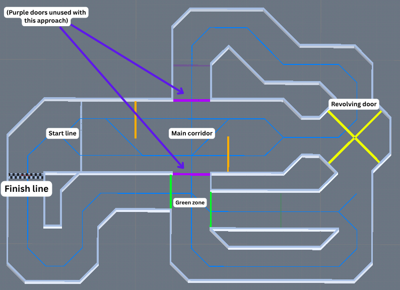
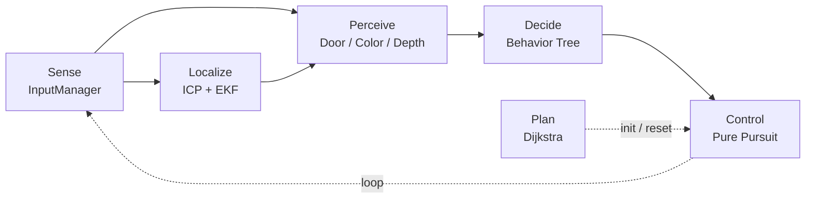
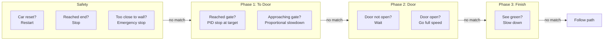

# BWSI 2026 Micro Grand Prix

**1st Place - BWSI 2026 Micro Grand Prix Finals (April 12, 2026) 🥇**

Autonomous racing controller for the BWSI 2026 Micro Grand Prix Pre-Competition. The car navigates a complex indoor track in three phases: approach a spinning revolving door, time the pass-through, then sprint to the finish.

## Competition Calendar

| Date | Event |
| :--- | :--- |
| 3/21 – 4/1 | Pre-Dev: Algorithm development |
| **3/30 (Mon)** | **BWSI Application Deadline**: Submit by 8:59 PM PT |
| **4/1 (Wed)** | **Registration Deadline**: [Intent to Compete Form](https://forms.gle/B98we9rZGydtAgRQ8) due 11:59 PM PT |
| 4/1 (Wed) | **Map Release**: New competition map released |
| 4/2 – 4/8 | Development Week: Test and tuning |
| **4/3 (Fri)** | **Teacher Recommendation Deadline**: Due by 8:59 PM PT |
| 4/9 – 4/11 | Code Adjudication: Team reviews code for violations |
| **4/12 (Sun)** | **Finals**: 12:00 PM – 1:00 PM PT via Zoom |

---

## Track Map



| Feature | Color in map | Description |
| :--- | :--- | :--- |
| **Start line** | Checkered (left side) | Two positions A (x=17.68, y=24.80) and B (x=17.68, y=26.80), auto-detected via orange color + depth camera (orange closer than 225 cm → start B, farther → start A) |
| **Orange gates** | Orange vertical lines | Two barriers that physically move up and down in the corridor; this controller uses a static map with them baked in as fixed walls, no dynamic detection of gate position |
| **Green zone** | Green lines | Trigger area near the finish; when camera detects green and depth < 5 m, car slows to 0.20 for ~1 second |
| **Revolving door** | Yellow X (right side) | 4-blade spinning door at (x=31.85, y=25.76); car times entry when blades reach ~44.5° |
| **Finish line** | Checkered (left side) | End goal at (x=14.08, y=23.82) |

**Map data files:**
| File | Description |
| :--- | :--- |
| `data/track_map.npy` | Binary occupancy grid for the global planner; includes purple walls and orange gates baked in, excludes green gates, and has a manually added wall between the start and finish lines |
| `data/track_map.json` | Grid metadata: resolution (1 cm/cell), world bounds |
| `data/map_features.json` | Door position, gate locations, wall definitions |
| `data/track_map_inference2.npy` | Clean map for ICP (no dynamic objects) |

---

## Usage

```bash
git clone https://github.com/BWSI-Best-Team/bwsi-micro-grand-prix-2026
cd bwsi-micro-grand-prix-2026

# Run in simulator
racecar sim src/main.py

# Manual drive mode (for testing sensors)
racecar sim src/test.py
```

**Configuration** (`controller_config.json`): only two keys are active, rest is legacy:
```json
{
  "print_log": true,
  "show_visualizer": false
}
```

---

## Architecture

Inspired by ROS2 Nav2. The system follows a plan -> sense -> localize -> perceive -> decide -> control pipeline.



| Stage | Module | Responsibility |
| :--- | :--- | :--- |
| **Plan** | `global_planner` | Compute initial global path using Dijkstra (no local planner as it is unnecessary for this track) |
| **Sense** | `InputManager` | Collect synchronized color, depth, lidar, and IMU data |
| **Localize** | ICP + EKF | Estimate vehicle pose by scan-to-map matching and motion fusion |
| **Perceive** | `DoorTracker` / `ColorDetector` / `DepthDetector` | Extract task-relevant scene state from sensor data |
| **Decide** | `race_tree` | Select the active behavior based on safety and mission state |
| **Control** | `PurePursuitTracker` | Track the planned path and output steering and speed commands |

### Behavior tree

Each frame checks left to right, first match executes, rest skipped:


---


## Detailed Docs

- [Perception](doc/perception.md): sensors, door tracker, color/depth detection, start position
- [Localization](doc/localization.md): ICP, EKF, IMU fallback, map manager
- [Planning](doc/planning.md): Dijkstra, path smoothing, costmap inflation, track map
- [Control](doc/control.md): Pure Pursuit, stopper PID, simulator speed hack
- [Behavior](doc/behavior.md): behavior tree framework, race phases, reset detection
- [Training](doc/training.md): ML pose estimator, data collection, CNN architecture
- [Configuration](doc/configuration.md): constants.py tuning parameters, controller_config.json toggles

---


### Startup (`start()`)

- Load config from `controller_config.json`
- Load track map + features
- Initialize ICP localizer (bake door blades into wall map)
- Detect start position A or B via orange color
- Plan global path: Dijkstra → resample → Savitzky-Golay smooth
- Open run log (`tmp/run_log.csv`)

---

## Side Notes

- Emergency stop logic existed but the trigger range was not tuned for high speed (1.8), which caused a collision during the final
- A velocity-aware stopping threshold should be added in the next revision
