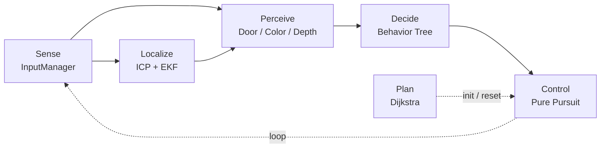
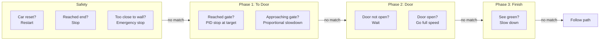

# BWSI 2026 Micro Grand Prix

**1st Place - BWSI 2026 Micro Grand Prix Finals (April 12, 2026) 🥇**

Autonomous racing controller for the BWSI 2026 Micro Grand Prix Pre-Competition. The car navigates a complex indoor track in three phases: approach a spinning revolving door, time the pass-through, then sprint to the finish.

## Competition Calendar

| Date | Event |
| :--- | :--- |
| 3/21 – 4/1 | Pre-Dev: Algorithm development |
| **3/30 (Mon)** | **BWSI Application Deadline**: Submit by 8:59 PM PT |
| **4/1 (Wed)** | **Registration Deadline**: [Intent to Compete Form](https://forms.gle/B98we9rZGydtAgRQ8) due 11:59 PM PT |
| 4/1 (Wed) | **Map Release**: New competition map released |
| 4/2 – 4/8 | Development Week: Test and tuning |
| **4/3 (Fri)** | **Teacher Recommendation Deadline**: Due by 8:59 PM PT |
| 4/9 – 4/11 | Code Adjudication: Team reviews code for violations |
| **4/12 (Sun)** | **Finals**: 12:00 PM – 1:00 PM PT via Zoom |

---

## Quick Start

```bash
# cd to your racecar folder first

git clone https://github.com/BWSI-Best-Team/bwsi-micro-grand-prix-2026
cd bwsi-micro-grand-prix-2026

# Run in simulator
racecar sim src/main.py

# Manual drive mode
#racecar sim src/test.py
```

---

## Track Map


> See [map.md](doc/map.md) for details

---

## Architecture

Inspired by ROS2 Nav2. The system follows a plan -> sense -> localize -> perceive -> decide -> control pipeline.

> See [architecture.md](doc/architecture.md) for details



### Behavior tree

Each frame checks left to right, first match executes, rest skipped:


---

## Detailed Docs

- [Architecture and Behavior](doc/architecture.md): architecture
- [Perception](doc/perception.md): sensors, door tracker, color/depth detection, start position
- [Localization](doc/localization.md): ICP, EKF, IMU fallback, map manager
- [Planning](doc/planning.md): Dijkstra, path smoothing, costmap inflation, track map
- [Control](doc/control.md): Pure Pursuit, stopper PID, simulator speed hack
- [Training](doc/training.md): ML pose estimator, data collection, CNN architecture
- [Configuration](doc/configuration.md): constants.py tuning parameters, controller_config.json toggles

---

## Side Notes

- Emergency stop logic existed but the trigger range was not tuned for high speed (1.8), which caused a collision during the final
- A velocity-aware stopping threshold should be added in the next revision
