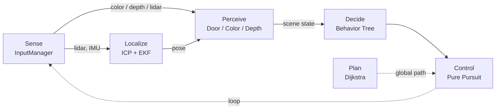
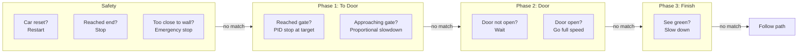

## Architecture

Inspired by ROS2 Nav2. The system follows a plan -> sense -> localize -> perceive -> decide -> control pipeline.

| Stage | Module | Responsibility |
| :--- | :--- | :--- |
| **Plan** | `global_planner` | Compute initial global path using Dijkstra (no local planner as it is unnecessary for this track) |
| **Sense** | `InputManager` | Collect synchronized color, depth, lidar, and IMU data |
| **Localize** | ICP + EKF | Estimate vehicle pose by scan-to-map matching and motion fusion |
| **Perceive** | `DoorTracker` / `ColorDetector` / `DepthDetector` | Extract task-relevant scene state from sensor data |
| **Decide** | `race_tree` | Select the active behavior based on safety and mission state |
| **Control** | `PurePursuitTracker` | Track the planned path and output steering and speed commands |

### Behavior tree

Each frame checks left to right, first match executes, rest skipped:

Decision-making is handled by a behavior tree (`src/behavior/`). This keeps the race logic organized as a priority-ordered set of conditions and actions, rather than a tangle of if/else statements.

#### Framework (`src/behavior/tree.py`)

Each node in the tree returns one of three statuses: `SUCCESS`, `FAILURE`, or `RUNNING`.

- **Sequence**: runs children left to right; stops and returns `FAILURE` if any child fails. Think of it as AND.
- **Fallback**: runs children left to right; stops and returns `SUCCESS` or `RUNNING` on the first non-failure. Think of it as OR / priority selector.
- **Condition**: wraps a boolean function; returns `SUCCESS` or `FAILURE`.
- **Action**: wraps a function that returns a `Status` directly.

#### Race Context

All nodes share a `RaceContext` object that holds the current state of the world: pose, velocity, lidar scan, door angle, color detection results, current phase, and the output drive command. Nodes read from it and write their speed/angle output back to `ctx.speed` and `ctx.angle`.

#### Phase transitions

- **Phase 1 → 2:** Stopper reaches the 20 cm stop target at the gate entry point
- **Phase 2 → 3:** Car reaches within 1 m of the gate exit waypoint after passing through
- **Any phase → 1 (reset):** Position jump > 5 m, IMU crash spike, out-of-bounds, or orange detected in camera during phases 2/3 (indicates teleport back to start)

#### Reset detection

The system watches for several signals that mean the simulator reset or the car crashed:
- Position jumps more than 5 m between frames
- IMU acceleration magnitude exceeds 5.0 m/s² (crash)
- Car is outside the map bounds
- Orange color detected in camera during phase 2 or 3 (only the start area has orange)

On reset, the ICP localizer is re-initialized, the path is replanned from start A, and the phase returns to 1.
