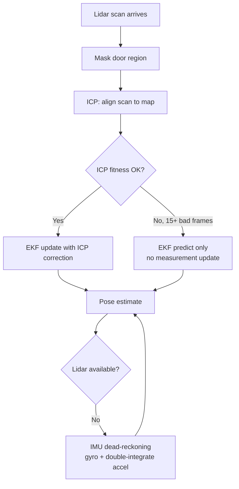

# Localization

The car needs to know where it is on the track at all times. We use a combination of ICP (Iterative Closest Point) and an EKF (Extended Kalman Filter) to get a reliable pose estimate from lidar scans, with IMU dead-reckoning as a fallback.

## How it works

Every frame, the localizer takes the raw lidar scan (720 beams) and tries to match it against a prebuilt occupancy map of the track. ICP finds the rotation and translation that best aligns the scan to the map walls. That correction gets fed into the EKF, which also tracks velocity and angular rate from the IMU to smooth out noise and handle frames where ICP struggles.

If ICP is consistently bad for 15 frames in a row (fitness score above the threshold), the system declares itself "lost" and falls back to just the EKF prediction until localization recovers.

One complication: the revolving door. Its blades show up as walls in the lidar scan, but they move, so we mask out points near the door center before running ICP to avoid corrupting the pose estimate.

## ICP (`src/localization/icp.py`)

Based on KISS-ICP. On each frame it solves for a 3-DOF correction `[dx, dz, dθ]` using weighted least squares on the closest wall points. Two things affect the weights:

- Points closer to walls get higher weight (they're more reliable matches)
- Points hitting walls at a shallow angle (grazing incidence) get lower weight (unreliable geometry)

Runs for up to 5 iterations or until convergence (`< 1e-4` change).

## EKF (`src/localization/localizer.py`)

State vector: `[x, z, yaw, v, ω]`

The predict step uses IMU accelerometer and gyro to propagate the state forward. The update step takes the ICP pose correction as a measurement. Measurement noise is adaptive: if recent ICP fits have been good, we trust it more; if they've been bad, we trust it less.

## Map Manager (`src/localization/map_manager.py`)

Precomputes a Euclidean distance field from the occupancy grid using `scipy.ndimage.distance_transform_edt`. This lets ICP quickly look up the distance from any point to the nearest wall, along with the gradient (wall normal direction), without doing any nearest-neighbor search at runtime.

## Fallback chain



IMU dead-reckoning (`src/perception/pose_estimator.py`) integrates gyro → yaw and double-integrates accelerometer → position. It drifts over time but is good enough for short gaps.

## Key constants (`src/util/constants.py`)

```python
ICP_CONFIG = {
    "icp_max_iter": 5,
    "icp_converge_thresh": 1e-4,
    "icp_initial_sigma": 0.5,
    "lost_fitness_thresh": 0.15,   # declare lost above this
    "lost_frame_count": 15,        # frames before declaring lost
}
```
