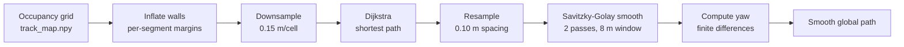

# Planning

Path planning runs once at startup (and again on reset). It produces a smooth global path from the start position to the finish, routed through the gate waypoints.

## Pipeline (`src/planning/global_planner/global_path.py`)



1. **Costmap**: inflate the occupancy grid walls by a configurable margin. This gives the path a safety buffer from walls. Different margins are used for different segments (tighter near the revolving door, wider for Phase 3).
2. **Dijkstra**: find the shortest path on a downsampled 0.15 m/cell grid. We use Dijkstra rather than A* because the costmap cells already encode traversal cost from wall proximity.
3. **Resample**: interpolate the raw grid path at 0.10 m spacing so the tracker has dense waypoints.
4. **Smooth**: apply Savitzky-Golay filtering (2 passes, 8 m window, cubic polynomial) to round out sharp corners from the grid.
5. **Yaw**: compute heading at each waypoint from finite differences between neighbors.

## Multi-segment paths

The race has three segments with different wall inflation:

| Segment | Inflation | Reason |
| :--- | :--- | :--- |
| Start → Gate entry | 0.25 m | Tighter, need to fit through the gate corridor |
| Gate exit → Finish | 0.55 m | Extra safety, wider margins after the door |
| Default | 0.45 m | General navigation |

Sharp corners get extra inflation on top of the base value (`CORNER_EXTRA_M`) to avoid cutting too close.

## Waypoints

The path is planned through four fixed world coordinates:

```
Start (A or B)  →  Gate entry (28.50, 25.00)  →  Gate exit (29.93, 21.32)  →  Finish (14.08, 23.82)
```

Start position is auto-detected at runtime; the rest are fixed constants.

## Track map (`src/util/track_map.py`)

The occupancy grid is loaded from `data/track_map.npy`. It has orange gates and purple walls baked in as permanent obstacles, with a manually added wall between the start and finish lines to prevent the planner from routing the wrong way around. Green gates are excluded since we slow down for them behaviorally rather than routing around them.

Grid resolution is 1 cm/pixel. For planning, the grid is downsampled to 0.15 m/cell to keep Dijkstra fast.

## No local planner

There is no local replanning at runtime. The path is fixed from startup. Obstacle avoidance during the run is handled reactively by the behavior tree (lidar-based emergency stops and slowdowns) rather than by replanning around obstacles.
